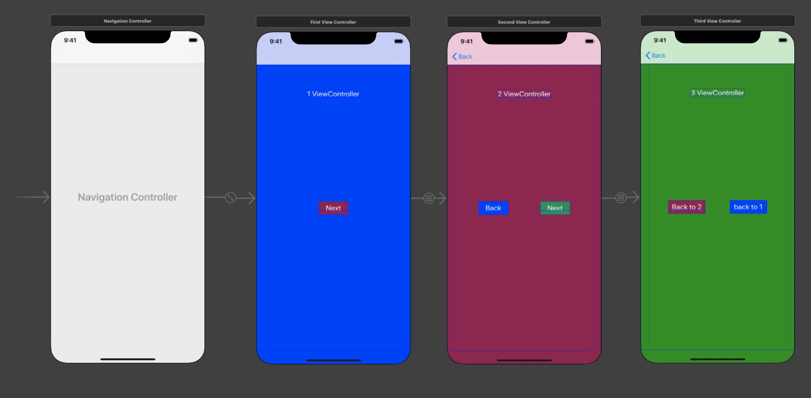
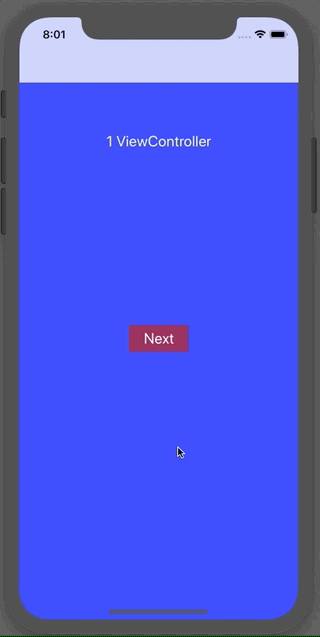
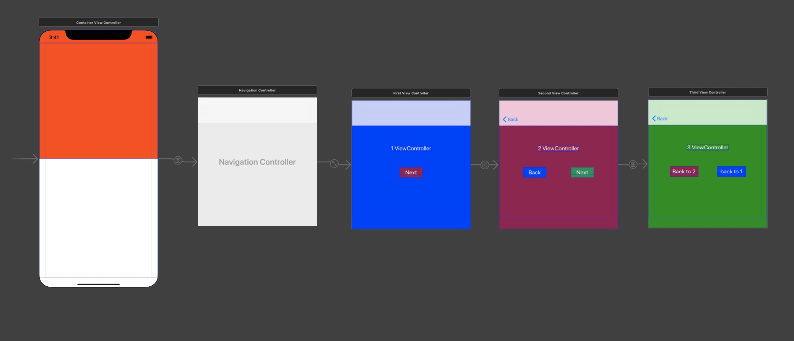
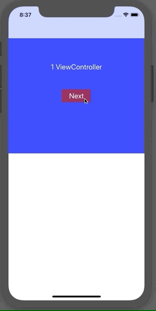

# Swift ViewController Examples

This repository is UIViewController and a sample using UINavigationController created in Swift. This is an example of screen transition in UINavigationController and segue, and an example of embedding UIViewController as a part in ContainerView.

# NavigationControllerBasic

This is simple example using UINavigationController.
It' use segue to showing another ViewController.

- Storyboard, UINavigationController and ViewController structure.  



- Demo  



### How to implement the back button

1. Implement unwindSegue in the previous ViewController class.

1. CTRL + Drag from ViewContorlller part on Storyboard and tie it to exit.

```swift
import UIKit

class FirstViewController: UIViewController {
  override func viewDidLoad() {
    super.viewDidLoad()
  }

  @IBAction func unwindActionFirstVC(unwindSegue _: UIStoryboardSegue) {}
}
```

# NavigatonInContainerView

This is example of UINavigationController in Containter View.
Containter View can include ViewController as a child.
It can also contain a container-type ViewController such as UINavigationController or UITabBarController.
In this example, ViewController transition same as NavigationControllerBasic project is performed in Container View.

- Storyboard, UINavigationController is embedded in Container View.



- Demo




# References

* [UIViewController \- UIKit \| Apple Developer Documentation](https://developer.apple.com/documentation/uikit/uiviewcontroller)

* [View Controller Programming Guide for iOS: Implementing a Container View Controller](https://developer.apple.com/library/archive/featuredarticles/ViewControllerPGforiPhoneOS/ImplementingaContainerViewController.html)


